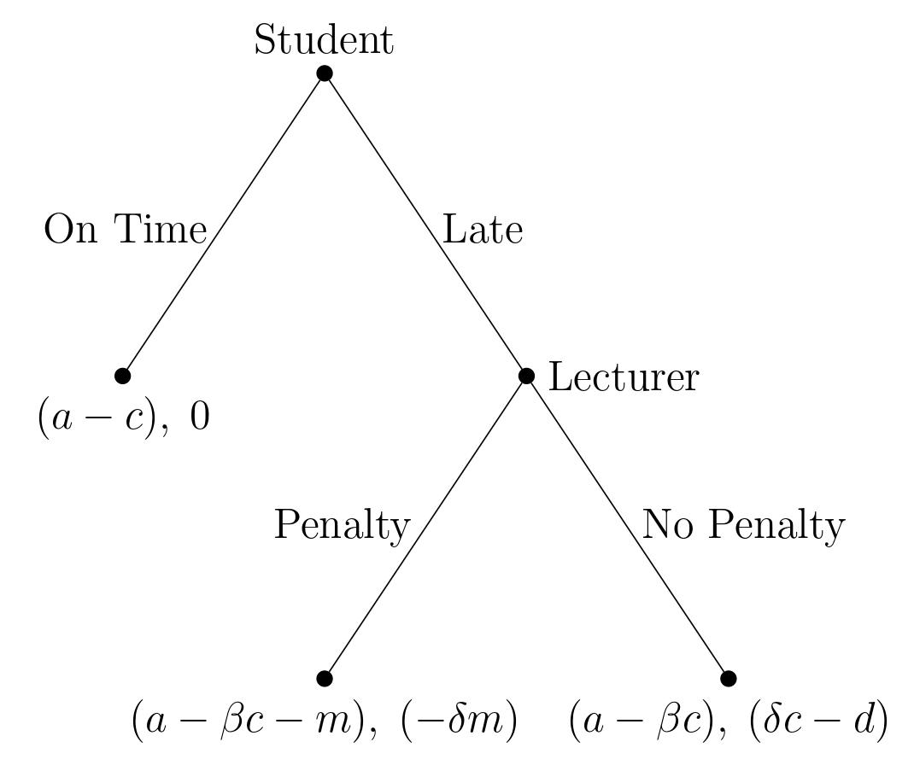

```{r setup, include=FALSE}
knitr::opts_chunk$set(echo = FALSE, message = FALSE, warning = FALSE, fig.width = 6, fig.height = 5, fig.pos="H", fig.pos = 'H')
```

<!-- ############################## -->
<!-- # Start Writing here: -->
<!-- ############################## -->
\newpage

# Introduction \label{intro} 

The relationship between a supervisor and a subordinate have been studied extensively [@power],[ @comm], [@trust]. A subordinate’s action is often influenced by the behaviour of the supervisor. Identity-based motivation theory describes that a positive relationship of trust and leniency between a subordinate and a supervisor will ultimately lead to both parties being better off in terms of reaching their goals, performance, and mental health [@trust]. Game theory models have been used to analyze the interactions between a supervisor and a subordinate [@book p.1]. A common situation that arises is a subordinate being assigned a task that should be complete before a deadline. Game theory can offer insights as to when a subordinate should submit a task on time or miss the deadline if there is incomplete information.

This article contributes to the existing literature by analyzing the dynamic relationship between a student and a lecturer.  We investigate a case where a student is required to submit an assignment with a deadline restriction but experiences a crisis before the deadline and must choose whether to submit her assignment on time or miss the deadline. We impose a structure of continuous types for both players, with a discrete set of actions. This essay is structured as follows: section \ref{lit} briefly discusses the literature on games of incomplete information and some applications. Section \ref{game} presents the deadline adherence game theory model; and section \ref{result} analyses the results of the game. The final section concludes \ref{con}.

# Games of Incomplete Information \label{lit} 

Real-life situations often lack full information @2020games. Von Neumann and Morgenstern [\textcolor{blue}{1944: 30} cited in @2004com] first used the term \emph{incomplete information} to a game theory model in which parts of the normal form structure is unspecified.  However, Von Neumann and Morgenstern [\textcolor{blue}{1944: 30} cited in @2004com] deemed any further research into this model as unimportant. Disagreeing @luce1956 extended on the literature on incomplete information by assuming that each player has a perception, which could be correct or incorrect, of the payoff function of the other player. However, @luce1956 did not consider uncertainty about strategies.  @harsanyi addressed the concerns of @luce1956 by developing a general analytical framework to analyze games of incomplete information. 

We follow the approach of @harsanyi in applying a game-theoretic model of incomplete information, where players have less than full information about each other’s payoff functions. Based on the Bayesian methodology, both players have expectations in the form of subjective probability distributions. Players have different types, which are randomly assigned and represents their belief about the game being played. However, players do not know the type of the other player @2020games. Both players attempt to estimate the probability of each other’s types, subject to the available information. To solve the model, the game of incomplete information will be reinterpreted as a game with complete and imperfect information, by transforming the basic mathematical structure.


# A Model of Deadline Adherence \label{game}

A student receives an assignment, which is due by a certain date set by the lecturer. While the student is working on the assignment, she undergoes a crisis and therefore spends less time on the assignment. She has two options: she can hand in the assignment on time or she can hand in late. If she hands in on time, she will get a payoff of $a-c$, where $a$ is the potential pre-crisis mark, and $c$ is the negative impact the crisis has on her mark. However, if she submits her project late, she has some time to recover after the crisis and reduce its academic impact. Her payoff is $a-\beta c -m$ if the lecturer gives her a penalty, where $m$ is the size of the penalty. She gets a payoff of $a-\beta c$ if there is no penalty. $\beta$ represents the type of the student, where a high $\beta$ suggests a low resiliency to crises and a low $\beta$ suggests a high resiliency and a better academic recovery. The student observes her own type but does not know the lecturer's type.

On the other hand, the lecturer is faced with the decision either to give a penalty ($m$) if a student submits late or not to give a penalty. If the lecturer gives a penalty, he feels bad since the student has gone through a crisis. The size of his disutility depends on the size of the penalty ($m$) and how empathetic the lecturer is, where the level of empathy describes the lecturer's type ($\delta$). The more empathetic the lecturer is, the higher $\delta$ is. The lecturer observes his own type but not that of the student. The lecturer's and student's types are both continuous types, which are independently and randomly chosen by nature at the start of the game from a uniform distribution^[A uniform distribution puts equal chance on any of the outcomes between 0 and 1 happening.]: $\delta \sim Uniform(0,1)$ and $\beta \sim Uniform(0,1)$. If the lecturer decides not to impose a penalty, he feels good that he did not impose on a student experiencing a crisis, and gets a positive payoff of $\delta c$. However, the lecturer knows that by waving the penalty, he may be encouraging this student, and other students to hand in late in the future. The lecturer would rather deter late hand-ins, and receives a negative payoff $-d$ for not deterring late hand-ins. This deterrent parameter relates to the literature on games of repeated interaction and reputations. 

The parameters $a,\, c,\, m\, \&\, d$ are all common knowledge. This is a game of incomplete information because the players' types are not common knowledge. The type spaces are continuous and the action spaces are discrete. Each player needs to choose his/her action based on his/her own type, what each believes the other player's type is, and the values of $a,\, c,\, m\, \&\, d$. Figure \ref{Figure1} shows the game in extensive form^[The simultaneous form game can be found in the appendix, \ref{tab1}]. And a summary of the game's parameters and restrictions are given in figure \ref{sum} below.

```{r Figure1,  warning =  FALSE, fig.align = 'center', fig.cap = "This game is a dynamic game where nature first chooses the student's and lecturer's types. Then the student moves, deciding to hand in on time or late after experiencing a crisis. If the student hands in late, the lecturer decides to impose a penalty or not. \\label{Figure1}", fig.ext = 'png', fig.height = 3, fig.width = 4}
library(knitr)  

```

```{r sum, results = 'asis', warning=FALSE, message=FALSE, echo=FALSE}

library(xtable)
source("code/game_summary.R")
data<- game_summary()


table <- xtable(data, caption = "Game Parameters \\label{sum}")
  print.xtable(table,
             # tabular.environment = "longtable",
             floating = TRUE,
             table.placement = 'H',
             # scalebox = 0.3,
             comment = FALSE,
             caption.placement = 'bottom',
             include.rownames = FALSE,
             sanitize.text.function=function(x){x},
             booktabs = T # Aesthetics
             )

```

# Results and Discussion \label{result}
 
In order to understand how the lecturer and student will make their decisions, we need to solve for the Bayesian Nash Equilibrium (BNE). By accounting for the beliefs that each player holds about the others' type, we can find their best response functions, set them equal and find the solution strategies^[For a full derivation of the solution concepts, please see Appendix \ref{B}]: 

For the student, her BNE strategy is: 
\begin{align*}
s_{\beta}^{*}(\beta)=\left\{\begin{array}{lll}
\text{On time} & \text{if} & \beta>1-\frac{m d}{c^{2}+m c}  \\
\text{Late} & \text{if} & \beta \leqslant 1-\frac{m d}{c^{2}+m c} 
\end{array}\right.
\end{align*}
 
And the lecturer's BNE strategy is: 
\begin{align*}
s_{\beta}^{*}(\beta)=\left\{\begin{array}{lll}
\text{Penalty} & \text { if } & \delta<\frac{d}{c+m} \\
\text{No penalty} & \text { if } & \delta \geq \frac{d}{c+m} \label{eq2}
\end{array}\right.
\end{align*}
 
From \ref{eq1} when the student is playing her equilibrium strategy, she wants to hand in on time if she has a resiliency level that is quite low, which equates to a $\beta$ value exceeding some threshold
 
 
<!--  We can deÖne this as a strategy si(θi) that maps some -->
<!-- θi 2 [0, 1] onto a corresponding e§ort ei 2 f0, 1g. Hence, -->
<!-- si(θi) will return either a 0 (shirk) or 1 (contribute) depending -->
<!-- on what value of θi -->
<!-- is chosen as player 1ís type. -->
<!-- Why arenít we mapping θj on to this function? Player i -->
<!-- cannot observe player jís type. -->

<!--  Model an everyday situation using games of incomplete information to demonstrate how -->
<!-- strategic thinking can help us better understand individual behaviour. -->
<!--  Faults with game -->
<!--  Run different examples -->


```{r tab2, results = 'asis', warning=FALSE, message=FALSE, echo=FALSE}

library(xtable)
source("code/game.R")
li <- game(a=0.8,c=0.15,B=0.2,D=0.2,m=0.05,d=0.09)
data <-li[[1]] 
br <- li[[2]]

table <- xtable(data, caption = "Simultaneous Game Best Response \\label{tab2}")
  print.xtable(table,
             # tabular.environment = "longtable",
             floating = TRUE,
             table.placement = 'H',
             # scalebox = 0.3,
             comment = FALSE,
             caption.placement = 'bottom',
             include.rownames = TRUE,
             booktabs = T # Aesthetics
             )
  
  tab <- xtable(br, caption = "Best Response\\label{tab3}")
  print.xtable(tab,
             # tabular.environment = "longtable",
             floating = TRUE,
             table.placement = 'H',
             # scalebox = 0.3,
             comment = FALSE,
             caption.placement = 'bottom',
             include.rownames = TRUE,
             booktabs = T # Aesthetics
             )

```

# Conclusion \label{con}

Extensions, generality
\newpage

# References {-}

<div id="refs"></div>

\newpage

# Appendix A \label{A} {-}

```{r tab1, results = 'asis', warning=FALSE, message=FALSE, echo=FALSE}

library(xtable)
source("code/simul.R")
data<- simul()


table <- xtable(data, caption = "Strategic form of the game \\label{tab1}")
  print.xtable(table,
             # tabular.environment = "longtable",
             floating = TRUE,
             table.placement = 'H',
             # scalebox = 0.3,
             comment = FALSE,
             caption.placement = 'bottom',
             include.rownames = TRUE,
             sanitize.text.function=function(x){x},
             booktabs = T # Aesthetics
             )

```

# Appendix B \label{B} {-}

## Payoffs \label{payoff} {-}

Student payoffs:
\begin{align*}
E[\text{On Time}]&= a- c \\
E[\text{Late}]&=  p(a-\beta c-m) +(1-p)(a-\beta c) \\
&=-m p+a-\beta c
\end{align*}
Student plays on time if:
\begin{align*}
a-c>a-m p-\beta c \\
\beta c>c-m p \\
\beta>\frac{c-m p}{c}
\end{align*}
Student plays late if:
\begin{align*}
\beta<\frac{c-m p}{c}
\end{align*}
Lecturer Payoffs:
\begin{align*}
E[\text{Penalty}]&=q(-\delta m)+(1-q)(0) \\
&=q(-\delta m) \\
E[\text{No Penalty}] &=q(\delta c-d)+(1-a)(0) \\
&=q(\delta c-d)
\end{align*}
Lecturer gives a penalty if:
\begin{align*}
q(-\delta m)&>q(\delta c-d) \\
-\delta m&>\delta c-d \\
d&>\delta(c+m) \\
\delta&<\frac{d}{c+m} \\
\delta &<\bar{\delta}
\end{align*}
Lecturer gives no penalty if:
\begin{align*}
\delta &\geq \frac{d}{c+m} \\
\delta &\geq \bar{\delta} \\
\end{align*}

## Best Responses \label{br} {-}
Solving for the best responses:
\begin{align*}
p=\text{Probability that the lecturer gives a penalty} = \bar{\delta}=\operatorname{Prob}(\delta<\bar{\delta})
\end{align*}
Substitute into the student's best response function - student hands in on time if:
\begin{align*}{}
\beta>\frac{c-m(\bar{\delta})}{c}
\end{align*}{}
Since $0 \leq \beta \leq 1$, $\beta$ cannot be greater than 1. This implies
\begin{align*}{}
\frac{c-m(\bar{\delta})}{c} \leq 1 \\
c-m \bar{\delta} \leq c \\
-m \bar{\delta} \leq 0 \\
0 \leq \bar{\delta}
\end{align*}{}
Since $0 \leq \bar{\delta} \leq 1$, this condition will always hold.
$\beta$ cannot be less than 0:
\begin{align*}
\frac{c-m \bar{\delta}}{c}&<0 \\
c-m \bar{\delta}&<0 \\
-m \bar{\delta}&< -c \\
\bar{\delta}&>\frac{c}{m}
\end{align*}
if $\bar{\delta}>\frac{c}{m} \Rightarrow \beta=0$, otherwise:
\begin{align*}
\beta =\frac{c-m \bar{\delta}}{c}
\end{align*}
Best response function for the student:
\begin{align*}
B R_{\beta}(\bar{\delta})=\left\{\begin{array}{lll}
\frac{c-m\bar{\delta}}{c} & \text { if } & \bar{\delta}\leq \frac{c}{m} \\
0 & \text { if } & \bar{\delta}> \frac{c}{m}
\end{array}\right.
\end{align*}
Best response function for the lecturer:
\begin{align*}
B R_{\delta}(\delta)=\left\{\begin{array}{lll}
0 & \text { if } & \delta<\frac{d}{c+m} \\
1 & \text { if } & \delta \geq \frac{d}{c+m}
\end{array}\right.
\end{align*}

## Bayesian Nash Equilibrium \label{bay}{-}
The Bayesian Nash equilibrium occurs at the point where the best response functions intersect.
For the BRFs to cross:
\begin{align*}
\text{Substitute} \; \bar{\delta} &= \frac{d}{c+m} \; \text{into} \; \beta=\frac{c-m\bar{\delta}}{c} \\
\text{Then:} \; \beta&=\frac{c}{c}-\frac{m}{c}\left(\frac{d}{c+m}\right) \\
\beta&=1-\frac{m d}{c^{2}+m c} \\
\end{align*}
BNE strategy for the student
\begin{align*}
s_{\beta}^{*}(\beta)=\left\{\begin{array}{lll}
\text{On time} & \text{if} & \beta>1-\frac{m d}{c^{2}+m c} \\
\text{Late} & \text{if} & \beta \leqslant 1-\frac{m d}{c^{2}+m c}
\end{array}\right.
\end{align*}
BNE strategy for the lecturer
\begin{align*}
s_{\beta}^{*}(\beta)=\left\{\begin{array}{lll}
\text{Penalty} & \text { if } & \delta<\frac{d}{c+m} \\
\text{No penalty} & \text { if } & \delta \geq \frac{d}{c+m}
\end{array}\right.
\end{align*}


